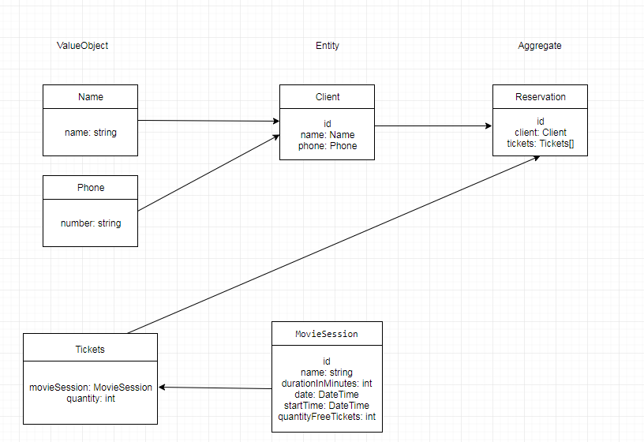

Доменная модель для сервиса бронирования билетов в кинотеатр.

Информации о сеансе кинофильма:
- Наименование кинофильма.
- Продолжительность фильма.
- Дата сеанса.
- Время начала сеанса.
- Время окончания сеанса.
- Количество билетов.

Запись забронированного билета:
- Информация о клиенте (имя, номер телефона).
- Фильм.
- Дата сеанса.
- Время сеанса.

При оформлении бронирования клиент указывает:
- Имя.
- Номер телефона.

